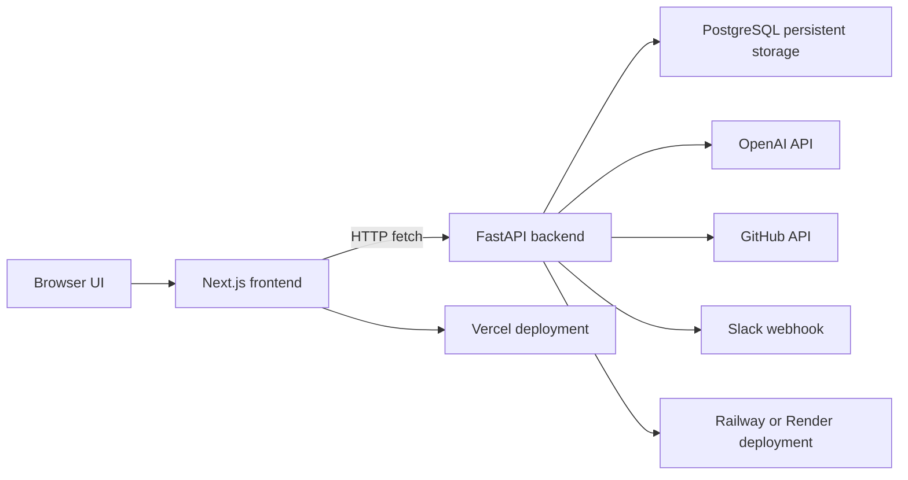
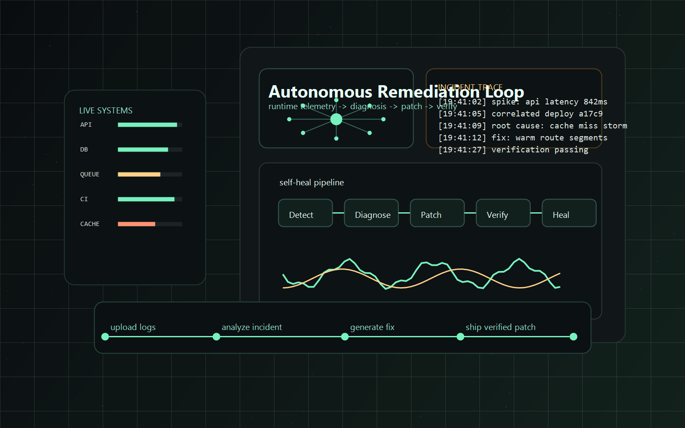
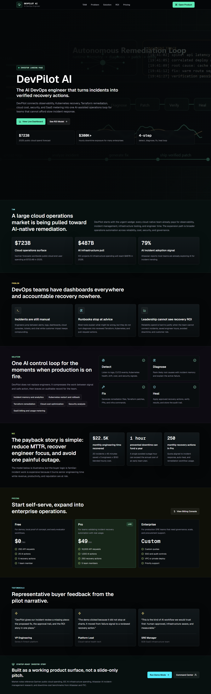
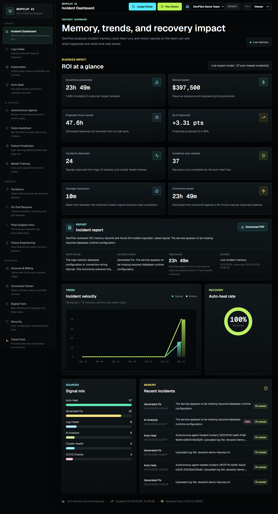
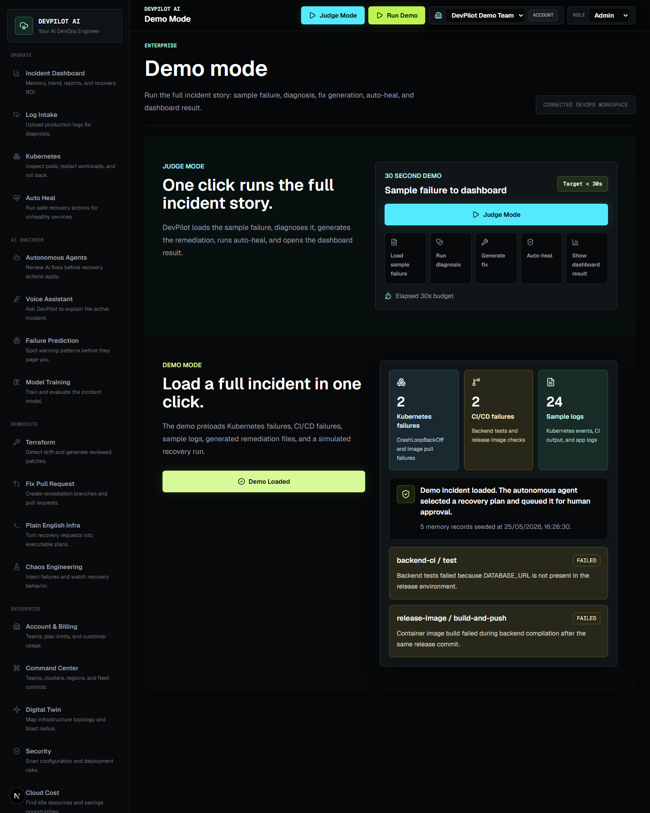

# DevPilot AI

Autonomous self-healing DevOps engineer for incident response, remediation, and deployment hygiene.

## Problem Statement

Production teams still spend too much time turning logs, alerts, drift, and security findings into safe fixes. DevPilot AI compresses that loop into one browser workflow: analyze the signal, generate the remediation, review the plan, and apply recovery with an audit trail.

## Architecture



## Screenshots






## Setup

### Prerequisites

- Node.js 22+
- Python 3.12+
- PostgreSQL 16+ for production

### Environment

Backend `.env`:

```text
APP_ENV=development
DATABASE_URL=
SESSION_SECRET=dev-only-change-me-please-generate-a-real-secret
OPENAI_API_KEY=
FRONTEND_ORIGINS=http://localhost:3000,http://127.0.0.1:3000
DEVPILOT_MAX_REQUEST_BODY_BYTES=1500000
DEVPILOT_RATE_LIMIT_WINDOW_SECONDS=60
DEVPILOT_RATE_LIMIT_REQUESTS_PER_WINDOW=120
GITHUB_TOKEN=
GITHUB_REPOSITORY=owner/repo
```

Frontend `.env.local`:

```text
NEXT_PUBLIC_API_URL=http://127.0.0.1:8000
NEXT_PUBLIC_ENABLE_LIVE_K8S_TWIN=false
```

### Run Locally

Backend:

```bash
cd backend
copy .env.example .env
python -m pip install -r requirements.txt
uvicorn main:app --reload --host 127.0.0.1 --port 8000
```

Frontend:

```bash
cd frontend
copy .env.example .env.local
npm ci
npm run dev
```

Open `http://127.0.0.1:3000`.

The first visit to an app route prompts you to create the initial owner account.
Production sessions use an HttpOnly signed JWT cookie plus a CSRF token; team
and role access are read from the backend session instead of browser storage.

### Production Checks

```bash
cd backend
python -m py_compile main.py

cd ../frontend
npm run build
```

Docker:

```bash
docker build -t devpilot-backend ./backend
docker build --build-arg NEXT_PUBLIC_API_URL=https://your-backend.example -t devpilot-frontend ./frontend
```

Full stack with persistent PostgreSQL and Nginx:

```bash
copy .env.example .env
# Replace POSTGRES_PASSWORD and SESSION_SECRET with generated secrets.
docker compose up --build
```

Nginx expects TLS files at `nginx/certs/fullchain.pem` and
`nginx/certs/privkey.pem`. The HTTP listener serves ACME challenge files from
`nginx/certbot/` and redirects app traffic to HTTPS.

## Demo Flow

1. Open the landing page.
2. Click `Run Demo`.
3. Review seeded Kubernetes failures, CI failures, and incident memory.
4. Open the dashboard to inspect remediation, usage, and recovery panels.
5. Ask the voice assistant: `Why did deployment fail?`

## Deployment

### Vercel

- Deploy the `frontend/` folder.
- Set `NEXT_PUBLIC_API_URL` to the Railway or Render HTTPS backend URL.
- The frontend uses `frontend/vercel.json` and `frontend/next.config.ts` for production output and headers.
- Store Vercel values in Project Settings, not in committed files.

### Railway or Render

- Deploy the `backend/` folder.
- Set `APP_ENV=production`.
- Attach a managed PostgreSQL database and expose its connection string as `DATABASE_URL`.
- Set `SESSION_SECRET` to a generated high-entropy value.
- Set `FRONTEND_ORIGINS` to the deployed Vercel URL.
- Set `OPENAI_API_KEY`, `GITHUB_TOKEN`, and `SLACK_WEBHOOK_URL` as needed.
- `backend/railway.toml` provides the Railway start command and `/ready` health check.
- `render.yaml` provides a Render Blueprint with a web service and Postgres database.

### Required Production Environment

Backend:

```text
APP_ENV=production
DATABASE_URL=postgresql://...
SESSION_SECRET=<generated secret>
FRONTEND_ORIGINS=https://your-vercel-app.vercel.app
```

Frontend:

```text
NEXT_PUBLIC_API_URL=https://your-backend.example.com
NEXT_PUBLIC_ENABLE_LIVE_K8S_TWIN=false
```

## Key Files

- `backend/main.py` - FastAPI API and incident workflows
- `backend/Dockerfile` - backend container build
- `backend/railway.toml` - Railway deployment config
- `render.yaml` - Render backend and PostgreSQL Blueprint
- `docker-compose.yml` - full-stack container deployment with persistent PostgreSQL
- `nginx/conf.d/default.conf` - HTTPS-ready reverse proxy config
- `frontend/src/app/` - Next.js routes
- `frontend/Dockerfile` - frontend container build
- `frontend/vercel.json` - Vercel deployment config

## Future Roadmap

- Redis-backed rate limiting and request tracking
- SSO and organization-level audit controls
- Background workers for long-running recovery jobs
- Exportable incident reports and approvals
- Persistent observability integrations
